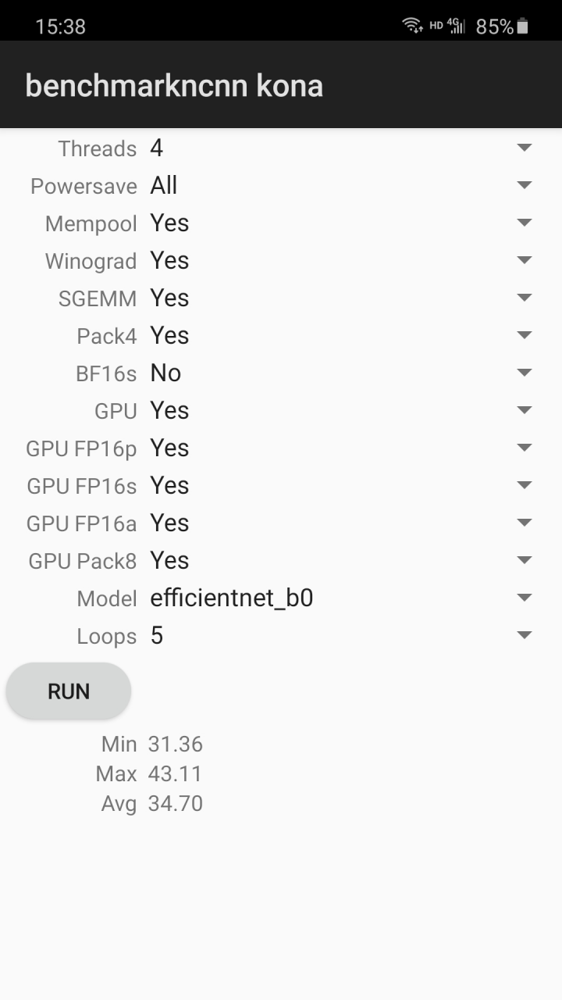

# ncnn-android-benchmark

The ncnn android benchmark app

this is a sample ncnn android project, it depends on ncnn library only

https://github.com/Tencent/ncnn

## download apk

prebuild apk file can be download from release page

https://github.com/nihui/ncnn-android-benchmark/releases

## how to build and run
### step1
https://github.com/Tencent/ncnn/releases

download ncnn-android-vulkan-lib.zip or build ncnn for android yourself

### step2
extract ncnn-android-vulkan-lib.zip into app/src/main/jni or change the ncnn path to yours in app/src/main/jni/CMakeLists.txt

### step3
open this project with Android Studio, build it and enjoy!

## screenshot

